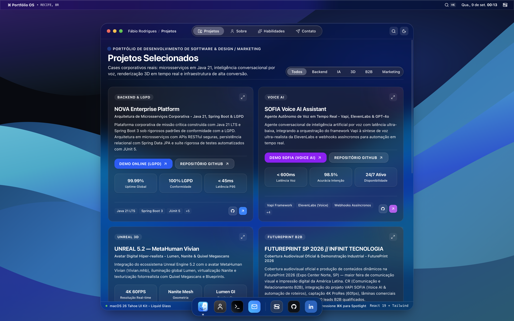
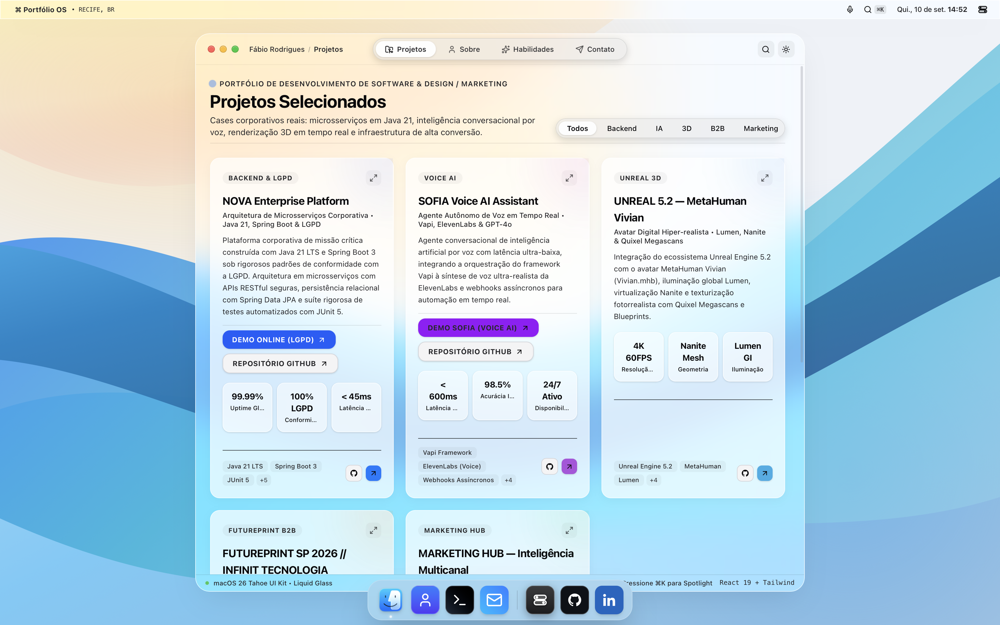
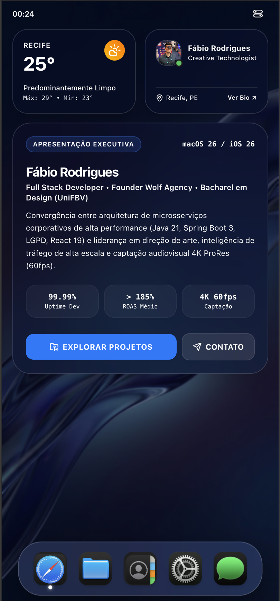
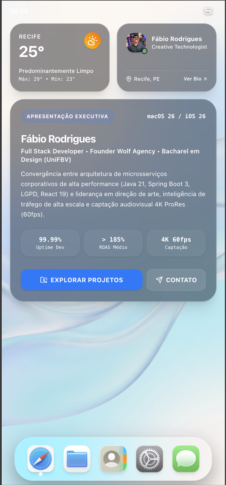

<div align="center">

  <!-- Badges de Tecnologia -->
  <p align="center">
    
    
    
    
    
    
  </p>

  <h1 align="center">Portfolio Creative Technologist — macOS 26 Tahoe / Liquid Glass</h1>

  <p align="center">
    <strong>Experiência imersiva de sistema operacional desktop e mobile desenvolvida com React 19, TypeScript e Tailwind CSS v4.</strong><br>
    Concebido sob o conceito óptico de vidro líquido (<em>Liquid Glass</em>) com refração avançada, física de profundidade e design responsivo <em>Edge-to-Edge</em>.
  </p>

  <p align="center">
    <a href="https://portfolio-liquid-glass-experience.vercel.app/" target="_blank" rel="noopener noreferrer">
      
    </a>
  </p>

</div>

---

## 🏛️ Engineering Architecture & Documentation

For a comprehensive technical deep-dive into optical physics, GPU layer composition, and dual-platform state orchestration, read the official dossier:
👉 **[Technical Architecture & Design System Dossier (docs/ARCHITECTURE.md)](./docs/ARCHITECTURE.md)**

*Specification grounded in [Apple Developer's Adopting Liquid Glass Documentation](https://developer.apple.com/documentation/technologyoverviews/adopting-liquid-glass).*

---

## 📸 Vitrine Visual & Demonstração da Interface

### 🖥️ Experiência Desktop — macOS 26 Tahoe Concept

Ambiente de trabalho completo com Menu Bar interativa, Dock dinâmico flutuante, Janelas com controles de semáforo (Traffic Lights), Spotlight Search instantâneo e Central de Controle com sliders hápticos.

<div align="center">
  <table>
    <tr>
      <td width="50%" align="center">
        <strong>🌙 Modo Escuro (Dark Theme)</strong><br><br>
        
      </td>
      <td width="50%" align="center">
        <strong>☀️ Modo Claro (Light Theme)</strong><br><br>
        
      </td>
    </tr>
  </table>
</div>

<br>

### 📱 Experiência Mobile — iOS 26 Edge-to-Edge

Transição inteligente de viewport com layout nativo de smartphone: Dynamic Island / Top Bar integrada, Widgets interativos, Central de Controle retrátil com controle gestual de volume/brilho e Home Bar.

<div align="center">
  <table>
    <tr>
      <td width="50%" align="center">
        <strong>🌙 Modo Escuro (Dark Theme)</strong><br><br>
        
      </td>
      <td width="50%" align="center">
        <strong>☀️ Modo Claro (Light Theme)</strong><br><br>
        
      </td>
    </tr>
  </table>
</div>

---

## 🌟 Visão Geral da Arquitetura & UI

Portfólio interativo concebido como um sistema operacional desktop e mobile de última geração (**macOS 26 Tahoe** & **iOS Liquid Glass**). O projeto ultrapassa os limites dos portfólios convencionais ao sintetizar engenharia de software de alta performance, design de interação refinado e simulação óptica em tempo real.

### 🔮 Motor Óptico Proprietário (Liquid Glass Engine)
- **Refração e Dispersão:** Aplicação de gradientes angulares, bordas translúcidas de alto contraste e micro-bordas de specular highlight.
- **Desfoque Multi-Camada:** Combinação de `backdrop-filter: blur(28px - 40px)` e filtros de saturação dinâmica para reproduzir com máxima fidelidade o comportamento físico do vidro sob luz ambiente.
- **Profundidade Tridimensional:** Sistema de sombras volumétricas em múltiplos eixos Z para desacoplar janelas, popovers e controles flutuantes.
- **Suporte Dual-Mode Contínuo:** Paleta cromática rigorosamente balanceada para alternância fluida entre **Dark Mode** e **Light Mode** sem perda de legibilidade ou quebra de contraste.

---

## ⚡ Principais Funcionalidades

### 🖥️ Desktop (macOS Tahoe)
- **Efeito Gênio (Genie Effect) Oficial:** Deformação em funil 3D e sucção acelerada da janela para o Dock acionável via botão amarelo do semáforo ou atalho `Cmd + M`, com cartão miniatura dedicado no Dock e restauração elástica instantânea.
- **Física de Janelas Tahoe:** Motor de física com interpolação contínua de dimensões (`480ms cubic-bezier(0.16, 1, 0.3, 1)`), duplo clique na barra de títulos e semáforo com ícones dinâmicos de restauração.
- **Central de Controle macOS:** Sliders táteis sem latência para brilho e volume, alternância de modo Foco, controle óptico Liquid Glass (*Translúcido* vs *Tonalizado*), controle de som do site e calibração óptica de alto contraste no Modo Dia (WCAG AAA).
- **Assistente NOVA (Apple Intelligence):** Integração multimodal com reconhecimento de voz contínuo, edge glow perimetral SVG, sintetizador harmônico Web Audio e controle por voz do sistema.
- **Menu Bar Interativa:** Relógio em tempo real, status de conectividade (Wi-Fi, Bluetooth, Bateria), microfone da NOVA, Menu Apple oficial e acesso rápido à Central de Controle.
- **Dock Dinâmica:** Efeito de escala e elevação com indicadores de aplicativos ativos, miniatura de janela minimizada e glassmorphism refinado.
- **Spotlight Search (`Cmd + K` / Ícone):** Janela de busca instantânea com filtro inteligente por projetos, tecnologias e contatos.
- **Player de Áudio & Visualizador Sonoro:** Player integrado com visualizador de frequências circular (`CircularVisualizer`) e efeitos sonoros hápticos nativos.
- **Janelas & Quick Look:** Navegação fluida por abas (*Sobre Mim*, *Projetos*, *Habilidades* e *Contato*) com suporte a visualização rápida em modal de alta resolução.

### 📱 Mobile (iOS Liquid Glass)
- **Detecção Automática de Viewport:** Reconhecimento em tempo de execução para servir a experiência mobile sob medida.
- **Central de Controle Tátil:** Gestos de puxar/fechar, toque externo seguro, sliders de volume e brilho com resposta imediata e botão Foco nativo em formato cápsula.
- **Navegação Adaptativa:** Dock inferior flutuante, barra Home sensível ao toque e cartões em coluna única com badges de auto-wrap sem transbordamento lateral.

---

## 🛠️ Stack Tecnológica & Engenharia Front-End

| Camada | Tecnologia | Propósito & Aplicação |
| :--- | :--- | :--- |
| **Core** | `React 19` | Arquitetura reativa baseada em hooks modernos e renderização otimizada. |
| **Linguagem** | `TypeScript 5+` | Tipagem estrita de estados do SO, eventos de janelas e interfaces de dados. |
| **Bundler & Build** | `Vite 8` | Compilação ultra-rápida, Hot Module Replacement (HMR) instantâneo e bundling leve. |
| **Design System** | `Tailwind CSS v4` | Utilitários de layout atômico integrados com a nova engine do Tailwind v4. |
| **Efeitos Ópticos** | `Vanilla CSS (Modern)` | Variáveis CSS personalizadas para refração de vidro, filtros de desfoque e sombras de profundidade. |
| **Iconografia** | `Lucide React` + `SVG Nativo` | Ícones oficiais com proporções e traços fiéis à linguagem visual da Apple. |
| **Qualidade & Lint** | `Oxlint` | Análise estática de código com foco em alta performance e consistência. |
| **Hospedagem & CI/CD** | `Vercel Edge Platform` | Deploy contínuo, compressão Brotli e distribuição global de ultra-baixa latência. |

---

## 📂 Estrutura do Projeto

```plaintext
portfolio-liquid-glass-experience/
├── docs/
│   └── ARCHITECTURE.md             # Technical Architecture & Design System Dossier
├── public/                         # Assets estáticos, capturas e wallpapers
│   ├── docs/images/                # Capturas de tela oficiais (Desktop & Mobile, Dark & Light)
│   ├── wallpapers/                 # Papéis de parede dinâmicos (Tahoe Light/Dark)
│   ├── icons/                      # Ícones de aplicativos nativos
│   └── profile.jpg                 # Foto de perfil oficial
├── src/
│   ├── assets/                     # Recursos gráficos locais
│   ├── components/                 # Componentes modulares da interface
│   │   ├── icons/                  # Ícones customizados e vetoriais
│   │   ├── mobile/                 # Experiência iOS (IOSMobileExperience, ControlCenterMobile)
│   │   ├── tabs/                   # Abas de conteúdo (About, Projects, Skills, Contact)
│   │   ├── audio/                  # Player e visualizador de frequências sonoras
│   │   ├── Dock.tsx                # Dock flutuante com magnificação
│   │   ├── MenuBar.tsx             # Barra superior nativa do macOS
│   │   ├── ControlCenter.tsx       # Central de Controle desktop
│   │   ├── SpotlightModal.tsx      # Janela de busca Spotlight
│   │   └── WindowFrame.tsx         # Janela principal e moldura com semáforo (Traffic Lights)
│   ├── context/                    # Contextos globais (ex: ThemeContext)
│   ├── data/                       # Dados dos projetos, habilidades e configurações
│   ├── lib/                        # Utilitários auxiliares e efeitos sonoros
│   ├── types/                      # Definições de tipos TypeScript
│   ├── App.tsx                     # Orquestrador central desktop/mobile
│   ├── index.css                   # Definições do motor Liquid Glass e Tailwind
│   └── main.tsx                    # Ponto de entrada da aplicação
├── package.json                    # Dependências e scripts do projeto
├── vite.config.ts                  # Configurações do Vite e plugins
└── README.md                       # Documentação técnica do repositório
```

---

## 🚀 Guia de Inicialização Local

Para rodar o projeto em sua máquina local de desenvolvimento:

```bash
# 1. Clone o repositório oficial
git clone https://github.com/fabiorodrigues-tech-dev/portfolio-liquid-glass-experience.git

# 2. Acesse a pasta do projeto
cd portfolio-liquid-glass-experience

# 3. Instale as dependências
npm install

# 4. Inicie o servidor de desenvolvimento
npm run dev
```

Após iniciar, acesse o endereço fornecido no terminal (geralmente `http://localhost:5173`) em seu navegador de preferência.

Para gerar a versão otimizada de produção:

```bash
npm run build
npm run preview
```

---

## 📬 Contato Comercial & Canais Oficiais

Desenvolvido por **Fábio André** — Creative Technologist & Front-End Developer.

- 💬 **WhatsApp Comercial:** [+55 (81) 99185-1507](https://wa.me/5581991851507)
- ✉️ **E-mail Direto:** [fabioandre777@gmail.com](mailto:fabioandre777@gmail.com)
- 💼 **LinkedIn:** [fabiorodrigues-dev](https://www.linkedin.com/in/fabiorodrigues-dev/)
- 🐙 **GitHub:** [fabiorodrigues-tech-dev](https://github.com/fabiorodrigues-tech-dev)
- 📁 **Google Drive Oficial (Portfólios & CVs):** [Acessar Pasta](https://drive.google.com/drive/folders/1rl-SPjOi4tisk2tACb2RcKKAmo6OmBrw)
